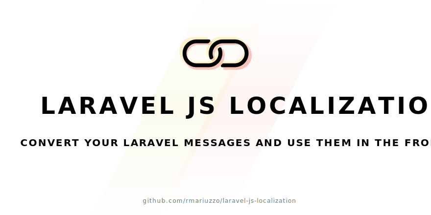

[](https://packagist.org/packages/mariuzzo/laravel-js-localization)
[](https://packagist.org/packages/mariuzzo/laravel-js-localization)
[](https://packagist.org/packages/mariuzzo/laravel-js-localization)

This package convert all your localization messages from your Laravel app to JavaScript with a small library to interact with those messages following a very similar syntax you are familiar with.

## Features

 - Support Laravel 4.2, 5.0, 5.1, 5.2, 5.3, 5.4 and 5.5.
 - Includes [Lang.js](https://github.com/rmariuzzo/lang.js) (a thin library highly inspired on Laravel's [`Translator`](https://laravel.com/api/5.4/Illuminate/Translation/Translator.html) class).
 - Allow to specify desired lang files to be converted to JS.
 - Lang.js API is based on Laravel's [`Translator`](https://laravel.com/api/5.4/Illuminate/Translation/Translator.html) class. No need to learn a whole API.

<table><tbody><tr><td>

:star: **Webpack user?** Try the new and shiny [**Laravel localization loader**](https://github.com/rmariuzzo/laravel-localization-loader) for Webpack!

</td></tr></tbody></table>


## Installation

```shell
composer require mariuzzo/laravel-js-localization
```

In your Laravel app go to `config/app.php` and add the following service provider:

```php
Mariuzzo\LaravelJsLocalization\LaravelJsLocalizationServiceProvider::class
```

## Usage

The `Laravel-JS-Localization` package provides a command that generate the JavaScript version of all your messages found at: `app/lang` (Laravel 4) or `resources/lang` (Laravel 5) directory. The resulting JavaScript file will contain all your messages plus [Lang.js](https://github.com/rmariuzzo/lang.js) (a thin library highly inspired on Laravel's [`Translator`](https://laravel.com/api/5.4/Illuminate/Translation/Translator.html) class).

### Generating JS messages

```shell
php artisan lang:js
```

### Specifying a custom target

```shell
php artisan lang:js public/assets/dist/lang.dist.js
```

### Compressing the JS file

```shell
php artisan lang:js -c
```

### Specifying a custom source folder

```shell
php artisan lang:js public/assets/dist/lang.dist.js -s themes/default/lang
```

### Output a JSON file instead.

```shell
php artisan lang:js --json
```

## Configuration

First, publish the default package's configuration file running:

```shell
php artisan vendor:publish --provider="Mariuzzo\LaravelJsLocalization\LaravelJsLocalizationServiceProvider"
```

The configuration will be published to `config/localization-js.php`.

You may edit this file to define the messages you need in your Javascript code. Just edit the `messages` array in the config file. **Empty messages array will include all the language files in build**.

To make only `pagination.php` and `validation.php` files to be included in build process:

```php
<?php

return [
    'messages' => [
        'pagination',
        'validation',
    ],
];
```

### Using [gulp](http://gulpjs.com/) (optional)

Install [`gulp-shell`](https://github.com/sun-zheng-an/gulp-shell) and then run it directly in your `gulpfile.js`:

```js
var shell = require('gulp-shell');

gulp.task('langjs', shell.task('php artisan lang:js -c public/js/messages.js'));
```

### Using [Laravel's elixir](http://laravel.com/docs/elixir) (optional)
Before Elixir 4.0:

```js
elixir.extend('langjs', function(path) {
    gulp.task('langjs', function() {
        gulp.src('').pipe(shell('php artisan lang:js ' + (path || 'public/js/messages.js')));
    });

    return this.queueTask('langjs');
});
```
Elixir 4.0+:
```js
var Task = elixir.Task;
elixir.extend('langjs', function(path) {
    new Task('langjs', function() {
        gulp.src('').pipe(shell('php artisan lang:js ' + (path || 'public/js/messages.js')));
    });
});
```

And use it like this:

```js
elixir(function(mix) {
    mix.langjs();
});
```

### Using [Laravel's Mix](https://laravel.com/docs/5.4/mix) with Laravel 5.4+ (optional)

Add "[webpack-shell-plugin](https://www.npmjs.com/package/webpack-shell-plugin)" to package.json's "devDependencies" section.

Add the following to webpack.mix.js:

```js
const WebpackShellPlugin = require('webpack-shell-plugin');

// Add shell command plugin configured to create JavaScript language file
mix.webpackConfig({
    plugins:
    [
        new WebpackShellPlugin({onBuildStart:['php artisan lang:js --quiet'], onBuildEnd:[]})
    ]
});
```

## Documentation

This is a quick documentation regarding [Lang.js](https://github.com/rmariuzzo/lang.js) (the thin JavaScript library included by `Laravel-JS-Localization`). The [Lang.js](https://github.com/rmariuzzo/lang.js) (a thin library highly inspired on Laravel's [`Translator`](https://laravel.com/api/5.3/Illuminate/Translation/Translator.html) class).

 > 💁 Go to [Lang.js documentation]([Lang.js](https://github.com/rmariuzzo/lang.js)) to see all available methods.

### Getting a message

```js
Lang.get('messages.home');
```

### Getting a message with replacements

```js
Lang.get('messages.welcome', { name: 'Joe' });
```

### Changing the locale

```js
Lang.setLocale('es');
```

### Checking if a message key exists

```js
Lang.has('messages.foo');
```

### Support for singular and plural message based on a count

```js
Lang.choice('messages.apples', 10);
```

### Calling the `choice` method with replacements

```js
Lang.choice('messages.apples', 10, { name: 'Joe' });
```

> 💁 Go to [Lang.js documentation]([Lang.js](https://github.com/rmariuzzo/lang.js)) to see all available methods.

## Want to contribute?

 1. Fork this repository and clone it.
 2. Create a [feature branch](https://guides.github.com/introduction/flow/) from develop: `git checkout develop; git checkout -b feature-foo`.
 3. Push your commits and create a pull request.

### Prerequisites:

You will need to have installed the following softwares.

 - Composer.
 - PHP 5.5+.

### Development setup

After getting all the required softwares you may run the following commands to get everything ready:

 1. Install PHP dependencies:
    ```shell
    composer install
    ```

 2. Install test dependencies:
    ```shell
    composer test-install
    ```

Now you are good to go! Happy coding!

## Testing

This project uses PHPUnit. All tests are stored at `tests` directory. To run all tests type in your terminal:

```shell
composer test
```

<div align=center>

Made with :heart: by [Rubens Mariuzzo](https://github.com/rmariuzzo).

[MIT license](LICENSE)

</div>
